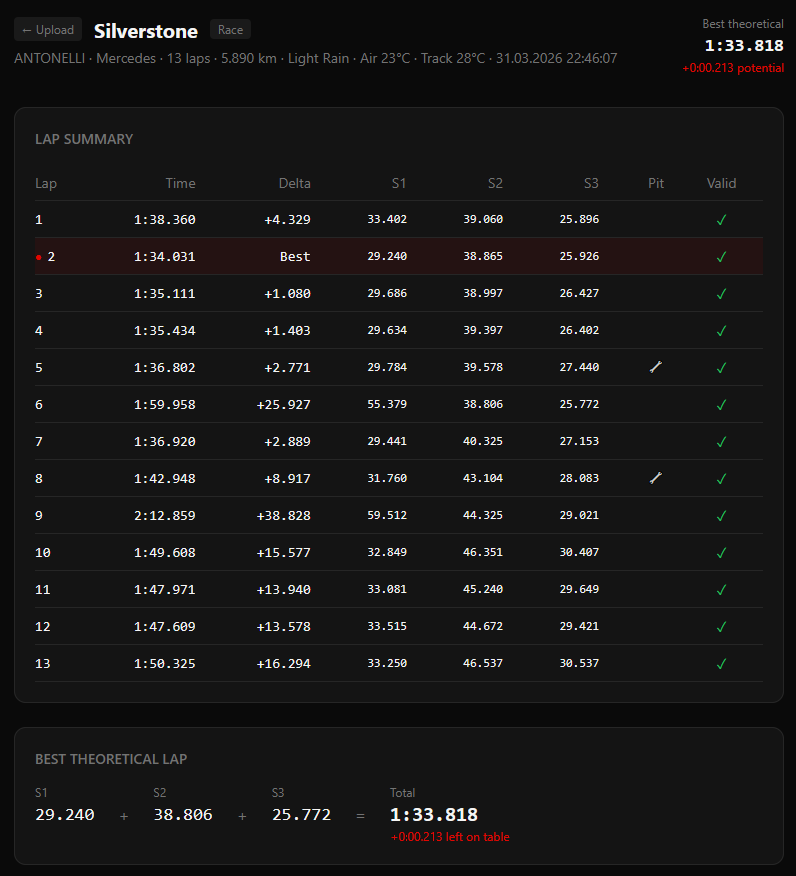
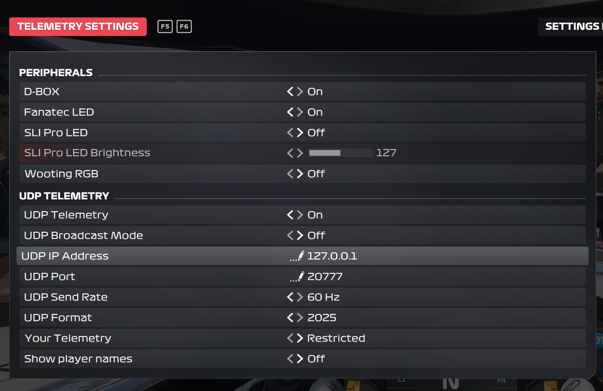
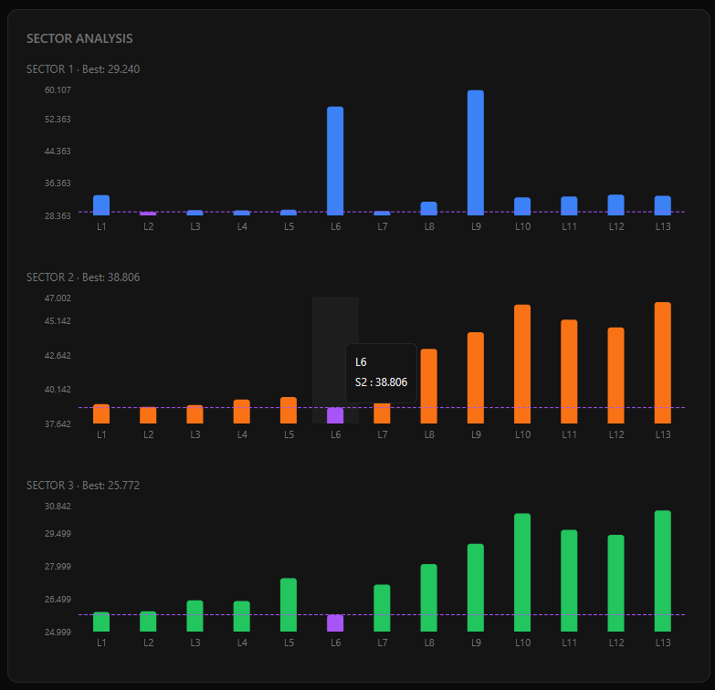
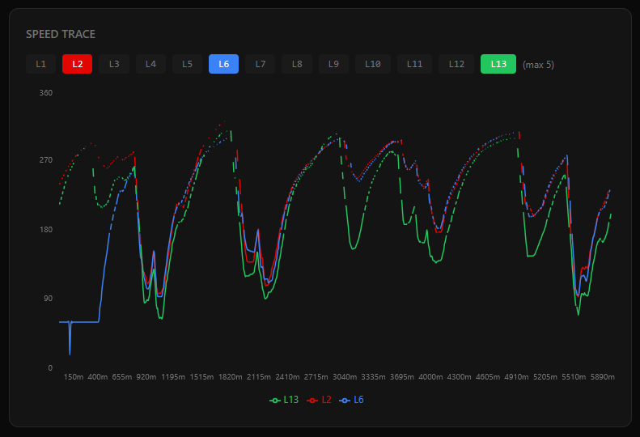
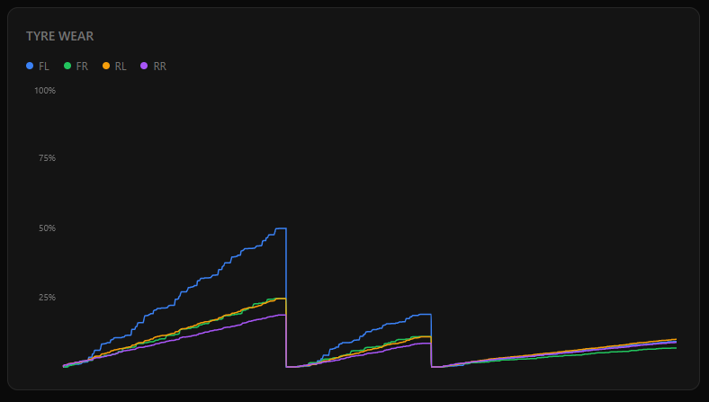
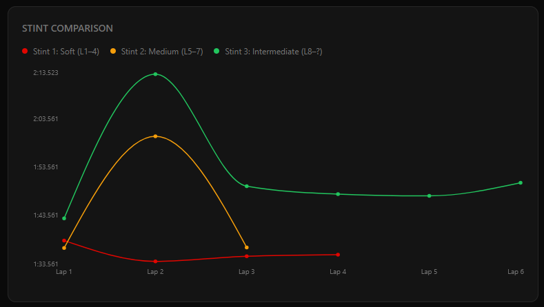

# F1tel 25

F1 2025 telemetry recorder and web visualizer for EA Sports F1 25.

Record your sessions with the Windows desktop app, then upload the `.f1tel` file to the web dashboard to explore your data - lap times, sector splits, speed traces, tyre and brake temperatures, stint comparisons, and more.

**Live:** https://f1tel.gnuadm.in

*Lap Summary*

---

## How It Works

**Gatherer** listens for UDP telemetry broadcast by the game on `127.0.0.1:20777` and saves it as a compressed `.f1tel` file.

**Web dashboard** parses the file entirely in your browser - no data is ever sent to a server. Close the tab and it's gone.

<iframe width="560" height="315" src="https://www.youtube.com/embed/CJ3XDsM6Q3k?si=MI4FaEFe-06dMh5k" title="YouTube video player" frameborder="0" allow="accelerometer; autoplay; clipboard-write; encrypted-media; gyroscope; picture-in-picture; web-share" referrerpolicy="strict-origin-when-cross-origin" allowfullscreen></iframe>

---

## Getting Started

### 1. Configure the game

In EA Sports F1 25:  
`Settings -> Telemetry Settings -> UDP Telemetry: On, UDP IP Address: 127.0.0.1, UDP Port: 20777`

### 2. Download the Gatherer

Download `f1tel-gatherer-25.exe` from [Releases](../../releases) and run it. No Python installation needed.

Start a session in the game. The app will detect it automatically and begin recording.

When done, click **Save** to save the `.f1tel` file.

### 3. Analyze

Go to [f1tel.gnuadm.in](https://f1tel.gnuadm.in), drop your file, and visualize your race.

*F1 2025 Telemetry Settings*

---

## Dashboard Panels

| Panel | Description |
|-------|-------------|
| Lap Summary | All laps with times, sector splits, delta to best, pit stops, validity |
| Best Theoretical Lap | Sum of best sector times - how much time is left on the table |
| Sector Analysis | Per-sector bar chart vs your personal best |
| Speed Trace | Speed vs track distance, overlay up to 5 laps |
| Tyre Surface Temperature | All 4 corners, ideal range highlighted |
| Brake Temperature | All 4 corners, ideal range highlighted |
| Stint Comparison | Lap time curves per stint when multiple stints exist |

---

## Privacy

Your `.f1tel` file never leaves your browser. The server only serves static files. No accounts, no storage, no tracking.

---

## Tech Stack

- **Gatherer:** Python 3.10+, CustomTkinter, PyInstaller
- **Web:** Next.js 16, TypeScript, Tailwind CSS, Recharts, Web Worker

## Demo

*Sector Analysis: Fastest S2 and S3 times on lap 6, right after pit stop.*

*Speed Trace: Speed comparison between 1st lap, fastest (2nd) lap and last lap (light rain).*

*Tyre Wear: Front Left tyre is degrading faster than expected.*

*Stint Comparison: Cost of intermediate tyres. Fast performance loss with soft tyres.*